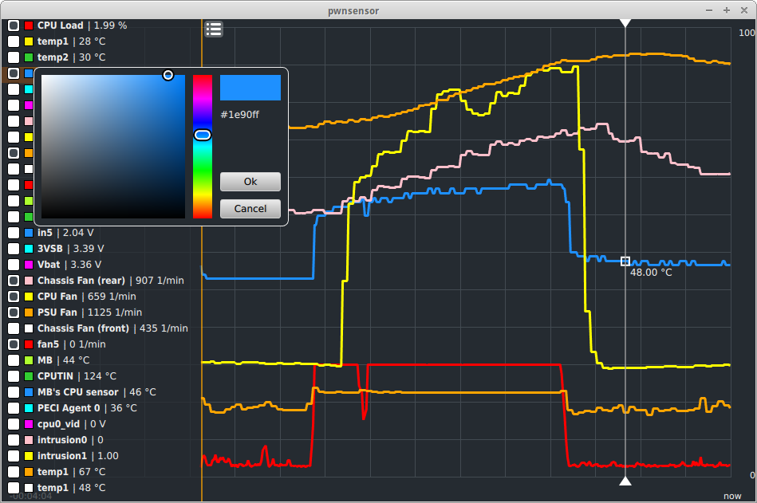

pwnsensor
=========

A Qt-based app to display and evaluate your computers sensor data using lm-sensors as backend. It's a modern approach using Qt Quick and QML in combination with OpenGL to render high quality graphs.

###Features
- modern, touch-screen friendly design and user interface
- OpenGL graphics for optimized performance
- based on lm-sensors


###How to install on Ubuntu
```bash
sudo add-apt-repository ppa:henrythasler/pwnsensor
sudo apt-get update
apt-get install pwnsensor
```
pwnsensor can be found under the *system* menu

Find more details on PPAs here: https://launchpad.net/~henrythasler/+archive/pwnsensor

###Screenshot


###useful Links

- Different geometry stuff: http://paulbourke.net/geometry/
- Anti-Aliased lines: http://artgrammer.blogspot.de/2011/05/drawing-nearly-perfect-2d-line-segments.html
